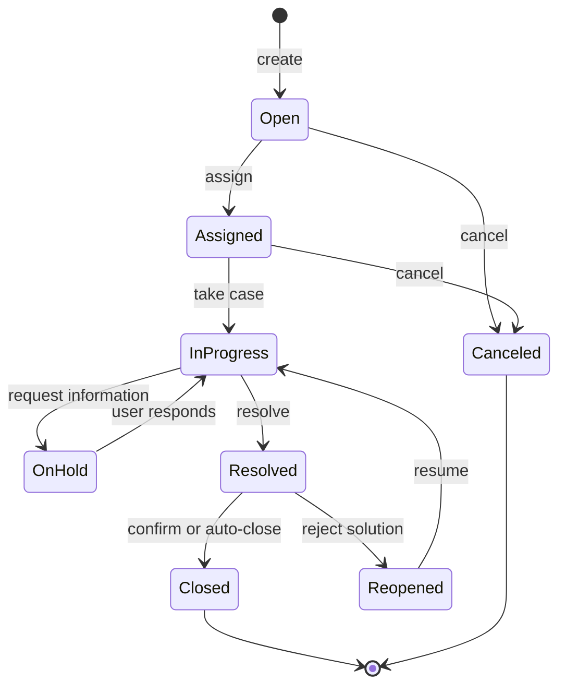

# 04. State Flow

The incident lifecycle is the core of the system. All transitions are defined in a single place on the backend (`ticket-workflow.ts`) and tests verify them.

## State machine

```mermaid
stateDiagram-v2
  [*] --> Open: create
  Open --> Assigned: assign
  Open --> Canceled: cancel
  Assigned --> InProgress: take case
  Assigned --> Canceled: cancel
  InProgress --> OnHold: request information
  OnHold --> InProgress: user responds
  InProgress --> Resolved: resolve
  Resolved --> Closed: confirm or auto-close
  Resolved --> Reopened: reject solution
  Reopened --> InProgress: resume
  Closed --> [*]
  Canceled --> [*]
```
